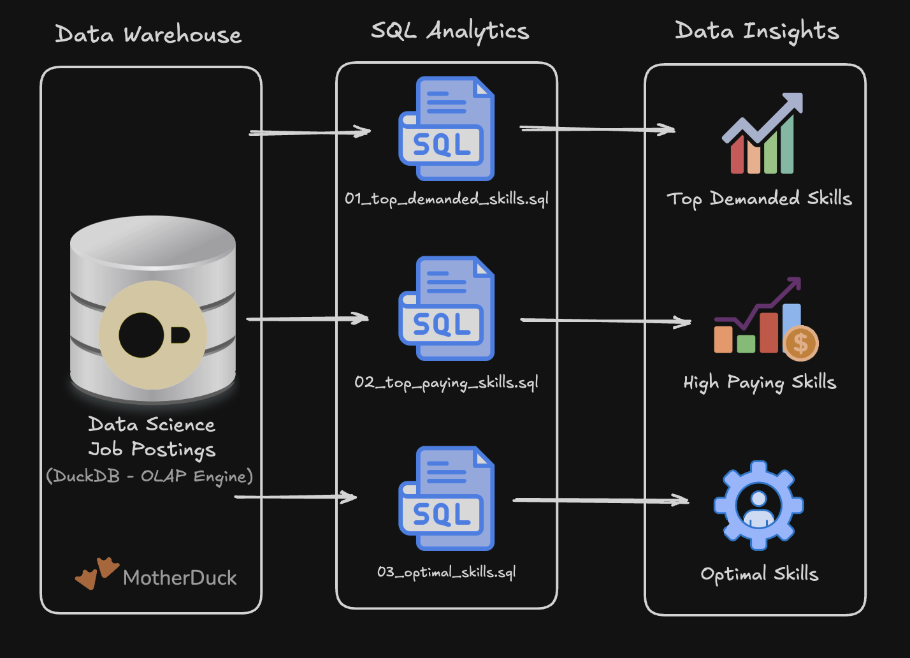
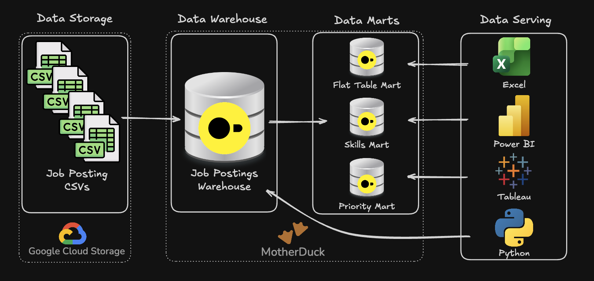

# Data Engineering Portfolio — SQL & Pipeline Projects

Hands-on projects built during a Data Engineering course, applying production-grade SQL patterns to real-world job market data. Each project focuses on a core competency of the data engineering stack: analytical querying, pipeline architecture, and dimensional modeling.

---

## Tech Stack

---

## Projects

### 1 — Exploratory Data Analysis: Job Market Analytics

SQL-driven analysis of the data engineering job market using real-world job posting data. Answers three core business questions: which skills are most in-demand, which command the highest salaries, and which offer the best balance of both.

**Key techniques:** Multi-table JOINs, aggregations, `HAVING` filters, natural log transformation for demand normalization

**→ [View Project](./1_EDA/README.md)**

---

### 2 — ETL Pipeline: Data Warehouse & Analytical Marts

End-to-end ETL pipeline that extracts raw CSV files from Google Cloud Storage, loads them into a normalized star schema data warehouse, and builds four specialized analytical data marts. Implements production-ready patterns including idempotent loads and incremental updates via MERGE.

**Key techniques:** Star schema design, CTAS, `MERGE INTO` (upsert), `DATE_TRUNC` for time-series, incremental pipeline orchestration

**→ [View Project](./2_WH_Mart_Build/README.md)**

---

## Core Skills Demonstrated

| Area | Skills |
|---|---|
| **Data Modeling** | Star schema, fact & dimension tables, bridge tables, many-to-many relationships |
| **ETL Development** | Extract from cloud storage, transform with SQL, idempotent loads, incremental updates |
| **Analytical SQL** | Window functions, CTEs, subqueries, aggregations, `CASE` expressions |
| **Data Quality** | NULL handling, deduplication, type safety, validation queries |
| **Production Patterns** | MERGE (upsert), `CREATE OR REPLACE`, pipeline orchestration with master scripts |
